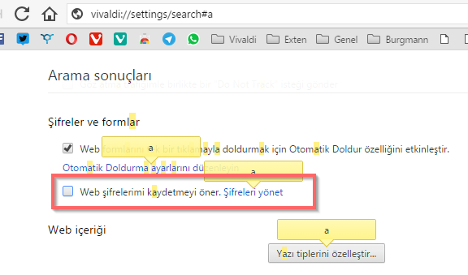

# Parola Hatırlatıcısını Nasıl Kapatabilirim?

Vivaldi'de henüz şifrelerin kaydedilmesi ile ilgili bir ayar bulunmuyor ve her sitede karşımıza çıkan uyarı penceresi can sıkabiliyor. Bunu ortadan kaldırmak için aşağıdaki yolu kullanabilirsiniz.

1- Adres satırına "[chrome://settings/search#a](chrome://settings/search#a)" (tırnak işareti olmadan) yazın ve bu ayara gidin.
2- Açılan sayfada Şifreler ve formlar altındaki Web şifrelerimi kaydetmeyi öner ayarını devre dışı bırakın.

