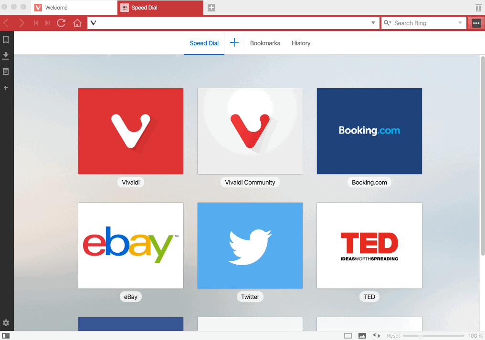

# Flash Player'ı Nasıl Yükeleyebiliriz?
============================

Vivaldi, Chrome ve Chromium gibi Flash’ın **Pepper sürümünü (PPAPI)** kullanmaktadır. Eğer web sitelerinde flash içerikleri görüntülemeye çalışırken “**Couldn’t load plugin**” (yan uygulama yüklenemedi) ya da “**You need to have the Adobe Flash Player to view this content**” (bu içeriği görüntülemek için Adobe Flash Player’ı yüklemeniz gerekiyor) gibi uyarılar alıyorsanız o zaman **Pepper Flash**’ı yüklemeniz gerekmektedir.

Aşağıdaki yönlendirmeleri takip ederek Flash player’ı Vivaldi için yükleyebilirsiniz.

* [Adobe Flash Player yükleme sayfasını](https://get.adobe.com/flashplayer/otherversions/) ziyaret edin.
* İşletim sisteminizi seçin.
* Chromium-PPAPI’yi seçin.
* “Şimdi indir”e tıklayın ve inen dosyayı çalıştırın.

Flash player’ı yükledikten sonra tarayıcınızı **yeniden açın ya da yeniden başlatın**.

İpucu: [vivaldi://plugins](vivaldi://plugins) sayfasını ziyaret ederek flash yan uygulamasının PPAPI ayarını gösterip göstermedini kontrol edin.

